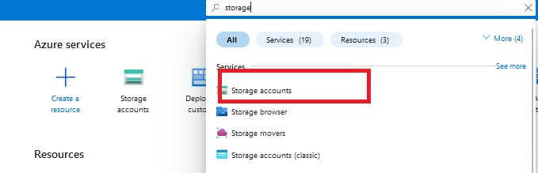

# Microsoft Defender for Endpoint Azure Connector for Joe Sandbox

**Latest Version:** 1.0.0 - **Release Date:** 19-06-2025

## Overview

This project is an integration between Microsoft Defender for Endpoint and Joe Sandbox. 
The connector will collect alerts and related evidences, and query or submit these samples into Joe Sandbox.
The connector will enrich your Microsoft Defender Alerts with Joe Sandbox analysis data (Score, Detection, Threatname and a link to the full analysis)

## Solution Overview
- The connector is built using Azure logic app, Azure functions app and Azure Storage.
  1. Azure Logic app `SubmitDefenderAlertsToJoeSandbox` monitors the alerts from MS Defender as soon any AV/EDR alerts are generated. If any AV/EDR alert is found, it will send the alert details to the Azure function app `JoeSandboxDefender`.
  2. Azure function app `JoeSandboxDefender` checks if the alert contains a file and checks if the file hash has already been analyzed by Joe Sandbox.
  3. If the hash was already analysed, the system checks if user configure to reanalyse the hash in configuration step, if yes it resubmits that to Joe Sandbox to reanalyze, if not it skips re-examining it.
  4. Azure function app `JoeSandboxDefender` requests the file from Microsoft Defender by starting a live response session.
  5. Microsoft Defender starts a live response session that run PowerShell code on the endpoint. The PowerShell moves the files out of quarantine to a temporary folder before sending to Azure storage(joesandbox-defender-quarantine-files) container. 
  6. Azure function app `JoeSandboxDefender` monitors the Azure storage(joesandbox-defender-quarantine-files) container and submits the quarantine file to Joe Sandbox.
  7. Azure function app `JoeSandboxDefender` will wait till the submission is completed and When the Joe Sandbox analysis is done JoeSandbox results are sent back to the Azure function app `JoeSandboxDefender`.
  8. The Azure function app `JoeSandboxDefender` post the results as a note within the relevant defender alert.
  9. If configured to send IOCs, the Azure function app `JoeSandboxDefender` provides the IOCs as the indicators to Microsoft Defender that may use them for automatically alerting or blocking.
   
**Note**: This solution can only analyze files quarantined by Defender Antivirus or flagged by Defender EDR. **It cannot access files that were removed or blocked by Defender,** and **It cannot access files if the Threat is still active in the system.**

you can verify on the endpoint, Windows Security > Protection History shows, if a threat was blocked (removed or restricted) or quarantined or active.

To improve alert enrichment, set the remediation action to "Quarantine: Moves files to quarantine" for all threat levels via Intune or Group Policy.

**Note**: Some threats may still be blocked by other mechanisms (e.g., EDR in block mode, active threat blocking).

## Requirements
- Microsoft Defender for Endpoint.
- Joe Sandbox Cloud Pro or Basic API key
- Microsoft Azure
  1. Azure functions with Flex Consumption plan.
     Reference: https://learn.microsoft.com/en-us/azure/azure-functions/flex-consumption-plan
     
	 **Note**: Flex Consumption plans are not available in all regions, please check if the region your are deploying the function is supported, if not we suggest you to deploy the function app with premium plan.

	 **Reference**: https://learn.microsoft.com/en-us/azure/azure-functions/flex-consumption-how-to?tabs=azure-cli%2Cvs-code-publish&pivots=programming-language-python#view-currently-supported-regions
  3. Azure functions Premium plan.
	 Reference: https://learn.microsoft.com/en-us/azure/azure-functions/functions-premium-plan
  4. Azure Logic App with Consumption plan.
     Reference: https://learn.microsoft.com/en-us/azure/logic-apps/logic-apps-pricing#consumption-multitenant
  5. Azure storage with Standard general-purpose v2.

## Microsoft Defender for Endpoint Configurations

### Creating Application for API Access

- Open [https://portal.azure.com/](https://portal.azure.com) and search `Microsoft Entra ID` service.

- Click `Add->App registration`.

- Enter the name of application, select supported account types, and click on `Register`.

- In the application overview you can see `Application Name`, `Application ID` and `Tenant ID`.

- After creating the application, we need to set API permissions for connector. For this purpose,
  - Click `Manage->API permissions` tab
  - Click `Add a permission` button
  - Select `APIs my organization uses`
  - Search `WindowsDefenderATP` and click the search result

- On the next page, select `Application Permissions` and check the permissions according to the table below. Then, click `Add permissions` button below.

|       Category       |   Permission Name   | Description                                                            |
|:---------------------|:--------------------|:-----------------------------------------------------------------------|
| Alert                | Alert.Read.All      | Needed to retrieve alerts and related evidence                         |
| Alert                | Alert.ReadWrite.All | Needed to enrich alerts with sample information                        |
| Machine              | Machine.LiveResponse | Needed to gather evidences from machines                               |
| Machine              | Machine.Read.All | Needed to retrieve information about machines                          |
| Ti                   | Ti.Read.All | Needed to retrieve indicators                                          |
| Ti                   | Ti.ReadWrite | Needed to retrieve and submit indicators (application specific)        |
| Ti                   | Ti.ReadWrite.All | Needed to retrieve and submit indicators (general)                     |
| Library              | Library.Manage | Needed to upload custom ps1 script for retrieving AV related evidences |

- After setting only the necessary permissions, click the `Grant admin consent for ...` button to approve permissions.

- We need secrets to access programmatically. For creating secrets
  - Click `Manage->Certificates & secrets` tab
  - Click `Client secrets` tab
  - Click `New client secret` button
  - Enter description and set expiration date for secret

- Use Secret `Value` and `Secret ID` to configure connector.

**Reference**
- [https://docs.microsoft.com/en-us/microsoft-365/security/defender-endpoint/api-hello-world](https://docs.microsoft.com/en-us/microsoft-365/security/defender-endpoint/api-hello-world)

### Activating Live Response and Automated Investigation

- Open [https://security.microsoft.com](https://security.microsoft.com)
- Open `Settings` page and `Endpoints` tab.
- Open `Advanced features`.
- Activate `Live Response`,  `Live Response for Servers` and `Live Response unsigned script execution` options.

## Microsoft Azure Function App Installation And Configuration

### Deployment of Function App 

#### Flex Consumption Plan

- Click on below button to deploy:

  

#### Premium Plan

- Click on below button to deploy:

  
  
  

- On the next page, please provide the values accordingly.
  

|       Fields       | Description                                                                                        |
|:---------------------|:---------------------------------------------------------------------------------------------------
| Subscription		| Select the appropriate Azure Subscription                                                          | 
| Resource Group 	| Select the appropriate Resource Group                                                              |
| Region			| Based on Resource Group this will be auto populated                                                |
| Function Name		| Please provide a function name if needed to change the default value                               |
| Azure Client ID   | Enter the Azure Client ID created in the App Registration Step                                     |
| Azure Client Secret | Enter the Azure Client Secret created in the App Registration Step                                 |
|Azure Tenant ID | Enter the Azure Tenant ID of the App Registration                                                  |
| Azure Storage Connection String| Please leave this empty                                                                            |
| Azure Storage Account Key| Please leave this empty                                                                            |
| App Insights Workspace Resource ID | Go to `Log Analytics workspace` -> `Settings` -> `Properties`, Copy `Resource ID` and paste here   |
| JoeSandbox API Key | JoeSandbox API Key                                                                                      |
| JoeSandbox Resubmit | If true, the files will be resubmitted to JoeSandbox analyser, even if the file hash was found in JoeSandbox |
| JoeSandbox API Retry Timeout | Provide maximum time to wait in minutes, when JoeSandbox API is not responding                          |
| JoeSandbox API Max Retry | Provide number of retries, when JoeSandbox API is not responding                                        |
| JoeSandbox Analysis Job Timeout | Provide maximum time to wait in minutes, when JoeSandbox Job submissions is not responding              |
| Defender API Retry Timeout | Provide maximum time to wait in minutes, when Microsoft Defender API is not responding.            |
| Defender API Max Retry | Provide number of retries, when Microsoft Defender API is not responding                           |
| Machine Availability Timeout | Provide maximum time to wait in minutes, when the machine is not responding                        |
| Machine Availability Retry | Provide number of retries, when machine is not responding                                          |	
- Once you provide the above values, please click on `Review + create` button.

### Storage Account Keys

- Open [https://portal.azure.com/](https://portal.azure.com) and search `Storage accounts` service.

- Open the storage account, the name starts with `joesecurity`.

- Go to `Security + networking` -> `Access keys`, Copy `Connection string` and save it temporarily for next steps.

- Go to `Security + networking` -> `Access keys`, Copy `Key` and save it temporarily for next steps.

### Configuration of Function App

- Open [https://portal.azure.com/](https://portal.azure.com) and search `Function App` service.

- Open the JoeSandbox FunctionApp name starts with `JoeSandboxDefender`.
- Go to `Settings`->`Environment variables`, double-click `AzureStorageConnectionString` and provide the `connection string` value copied in the previous step and click on `save`.
- Go to `Settings`->`Environment variables`, double-click `AzureStorageAccountKey` and provide the `Key` value copied in the previous step and click on `save`.
- Click on `Apply` -> `Confirm` buttons.

- Go to `Overview` -> click on `Restart`.

## Microsoft Azure Logic App Installation And Configuration

### Submit-Defender-Alerts-To-JoeSandbox Logic App Installation

- This playbook is mandatory. The Logic App collects the Defender Alerts and sends to JoeSandbox Function App Connector for further processing.

- Click on below button to deploy:

  

- On the next page, provide the appropriate `Subscription` and `Resource group` and click on `Review & create`.

  **Note**: When deploying the function app if you chose a different name, please kindly provide the same name here as well.
  
  

- Once the deployment is complete, go to newly deployed logic app, click on edit. The logic app will open in a designer mode.

- Click on the `WDATP Trigger`, click on `Add new`.

- On the next page, choose `Authentication` as `Service principal`, and provide the `ClientId`, `Client Secret` and `Tenant` values created via Entra ID app registration previously.

- Click on `Alerts - Get single Alert` action, click on `Change connection` and select the connection created above.

#### Filtering the Defender alerts

- If you would like to filter the Defender alerts based on alert severity or alert status, click on `Parameters`, and set the `DefenderAlertSeverity` and `DefenderAlertStatus` property values accordingly.

- Allowed values for `DefenderAlertSeverity` parameter are listed below, kindly note all values are case-sensitive
	* High
	* Medium
	* Low
	* Informational
	* UnSpecified
	
- For example, if you want to filter the alert by "Medium" and "High" severity, you need to set the value as ["Medium","High"].
	
- Allowed values for `DefenderAlertStatus` parameter are listed below, kindly note all values are case-sensitive
	* New
	* InProgress
	* Resolved
	* Unknown

- For example, if you want to filter the alert by "New", you need to set the value as ["New"].

- Save the Logic App.

## Disable Microsoft Defender for JoeSandbox Storage Account

- Defender for storage will remove any malware uploaded to a Blob storage. If you are using Microsoft Defender for Storage you need to exclude the JoeSandbox storage.

- Open [https://portal.azure.com/](https://portal.azure.com) and search `Storage accounts` service.

- Open the storage account, the name starts with `joesecurity`.
- Go to `Microsoft Defender For Cloud`->`settings`, disable the `Microsoft Defender For Storage` and click on `save`.

## Microsoft Defender Alert Joe Sandbox Enrichment Sample Images

## Expected Issues With LogicApps
- Logic App `SubmitDefenderAlertsToJoeSandbox` runs will fail after 2 minutes. This is a expected behaviour and is not an issue.

    
## Debugging
- To debug and check logs, follow these steps:
  1. Navigate to the Azure Function App.
  2. Select the function that starts with "JoeSandboxDefender".
  3. In the Function section below, choose "JoeSandboxDefender".
     

  4. Go to the Invocation tab.
     

  5. Find the execution based on the start time received in the email and match it with the invocation_id from the email.
     

  6. Review all logs under the selected execution.
     

## Version History

| Version        | Release Date | Release Notes
|:---------------|:-------------|:---------------- |
| 1.0.0          | `19-06-2025` | <ul><li>Initial Release</li></ul> |
